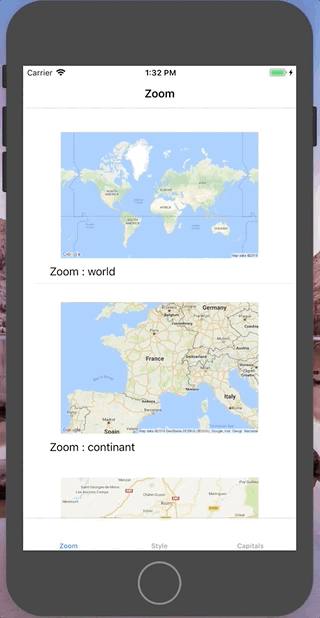
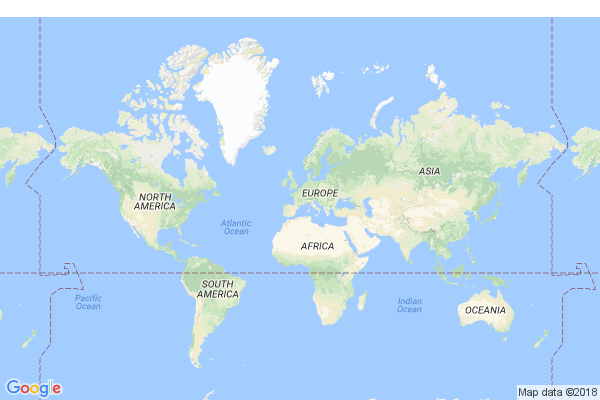
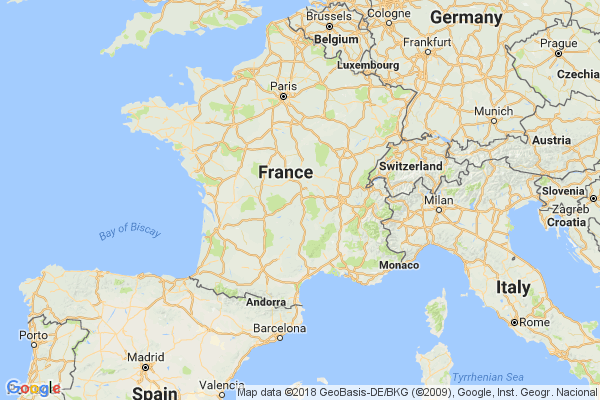
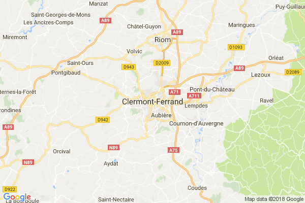
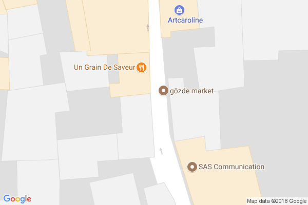
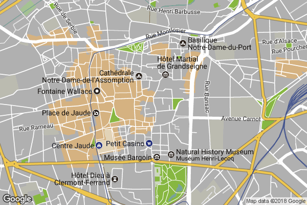
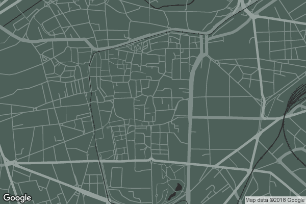
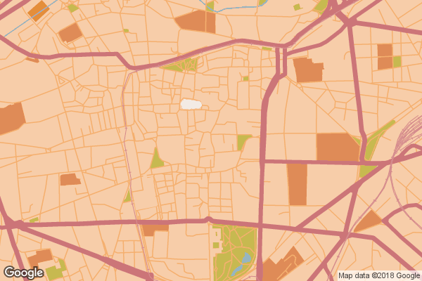
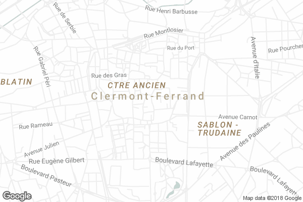

<h3 align="center">
<a href="https://github.com/PoissonBallon/GoogleStaticMapsKit">

<br />
</a>
GoogleStaticMapsKit
</h3>

------

[](http://cocoapods.org/pods/GoogleStaticMapsKit)
[](https://github.com/Carthage/Carthage)
[](http://cocoapods.org/pods/GoogleStaticMapsKit)
<!-- [](https://travis-ci.org/PoissonBallon/GoogleStaticMapsKit) -->
[](https://developer.apple.com/swift/)
<!-- [](https://coveralls.io/github/PoissonBallon/GoogleStaticMapsKit?branch=master) -->
[](http://cocoapods.org/pods/GoogleStaticMapsKit)

GoogleStaticMapsKit provides a full, lightweight swift API for dealing with Google Static Maps API.

## Preview



### Zoom

<table border="1" cellpadding="5">

<tr>

<td align="center" valign="center">

<br />
Zoom : .world
</td>

<td align="center" valign="center">

<br />
Zoom : .continant
</td>

<td align="center" valign="center">

<br />
Zoom : .city
</td>

<td align="center" valign="center">

<br />
Zoom : .street
</td>

<td align="center" valign="center">

<br />
Zoom : .building
</td>

</tr>

</table>


### Style

<table border="1" cellpadding="5">

<tr>

<td align="center" valign="center">

<br />
  <a href="https://snazzymaps.com/style/18/retro">Style : [Retro]</a>
</td>

<td align="center" valign="center">

<br />
  <a href="https://snazzymaps.com/style/72543/assassins-creed-iv">Style : [Assassin's Creed IV]</a>
</td>

<td align="center" valign="center">

<br />
  <a href="https://snazzymaps.com/style/93/lost-in-the-desert">Style : [Lost in the desert]</a>
</td>

<td align="center" valign="center">

<br />
  <a href="https://snazzymaps.com/style/8097/wy">Style : [WY]</a>
</td>

</tr>

</table>

## Getting Started

### Example

```swift
// Setting up the API Key (probably in AppDelegate)
GoogleStaticMaps.setAPIKey(apiKey: "your_api_key")


let parameters = Parameters(size: ImageSize(width: 600, height: 400))
let location = Location(center: .geo(latitude: 45.7772, longitude: 3.0870), zoom: .city)
let gsm = GoogleStaticMaps(location: location, parameters: parameters)

let url = gsm.toURL

print("Result : \(url)")
```

## Style

GoogleStaticMapKit was designed to support JSON Style like [SnazzyMaps](https://snazzymaps.com/)

```swift
[...]
let path = jsonFilePath
let styles = StylesImporter.fromJson(path: path).styles
let feature = Feature(styles: styles)
let gsm = GoogleStaticMaps(location: location, parameters: parameters, feature: feature)

```

For more information about Google Maps Style you can look on the official [Google Documentation](https://developers.google.com/maps/documentation/static-maps/styling)


## Support

* Location parameters
  * [x] Center by coordinates
  * [x] Center by adress
  * [x] Zoom Level
* Map parameters
  * [x] Size
  * [x] Scale
  * [x] Format (png/gif/jpg)
  * [x] Map Type (roadmap / satellite / hybrid / terrain)
  * [x] Language
  * [x] Region
* Feature parameters
  * [x] Markers
  * [ ] Path
  * [ ] Visible
  * [x] Style
* Key and Signature parameters
  * [x] Key
  * [ ] Signature

## Installation

GoogleStaticMapsKit is available through [CocoaPods](http://cocoapods.org). To install
it, simply add the following line to your Podfile:

#### CocoaPods
```ruby
use_frameworks!
pod "GoogleStaticMapsKit"
```

#### Carthage
```ruby
github 'PoissonBallon/GoogleStaticMapsKit'
```


#### Swift Package Manager
```swift
let package = Package(
    name: "MyPackage",
    dependencies: [
        .Package(url: "https://github.com/PoissonBallon/GoogleStaticMapsKit", majorVersion: 1),
    ]
)
```

## Author

* PoissonBallon [@poissonballon](https://twitter.com/poissonballon)

## License

GoogleStaticMapsKit is available under the MIT license. See the LICENSE file for more info.
